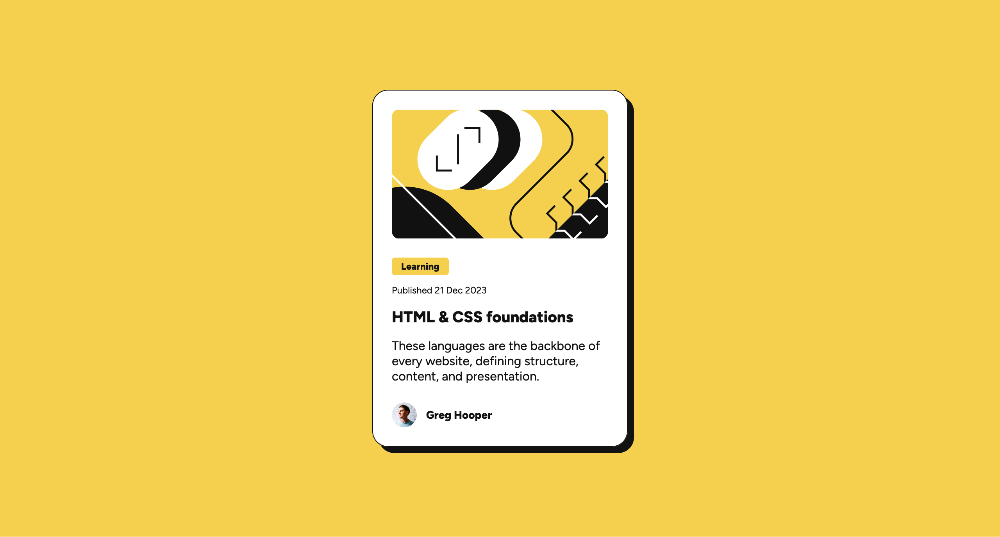
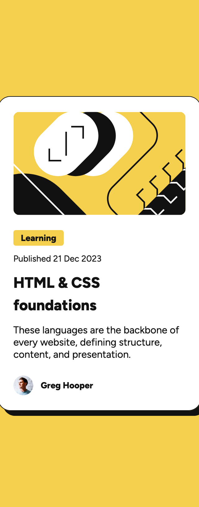

# Frontend Mentor - Blog preview card solution

This is a solution to the [Blog preview card challenge on Frontend Mentor](https://www.frontendmentor.io/challenges/blog-preview-card-ckPaj01IcS). Frontend Mentor challenges help you improve your coding skills by building realistic projects. 

## Table of contents

- [Overview](#overview)
  - [The challenge](#the-challenge)
  - [Screenshot](#screenshot)
  - [Links](#links)
- [My process](#my-process)
  - [Built with](#built-with)
  - [What I learned](#what-i-learned)
  - [Continued development](#continued-development)
  - [Useful resources](#useful-resources)
- [Author](#author)

## Overview

### The challenge

Users should be able to:

- See hover and focus states for all interactive elements on the page

### Screenshot




### Links

- Solution URL: [Add solution URL here](https://your-solution-url.com)
- Live Site URL: [Add live site URL here](https://your-live-site-url.com)

## My process

### Built with

- Semantic HTML5 markup
- CSS 
- Flexbox
- Mobile-first workflow

### What I learned

I used CSS media queries to create a responsive design for my blog preview card. Here's an example of how I used media queries to adjust the layout and font sizes for larger screens starting with a mobile-first approach:

```css
@media (max-width: 400px) {
    .card {
        max-width: 384px;
    }
    .category,
    .published-date {
        font-size: 14px;
    }
    .title {
        font-size: 24px;
    }
    .description {
        font-size: 16px;
    }
}
```

### Continued development

Learning more about responsive design and accessibility

### Useful resources

- [MDN Web Docs semantic HTML cheatsheet](https://developer.mozilla.org/en-US/docs/Learn_web_development/Howto/Solve_HTML_problems/Cheatsheet) - This helped me understand semantic HTML and how to use it effectively.
- [CSS Tricks](https://css-tricks.com/) - This is an excellent resource for learning CSS and web development in general.
- [W3Schools](https://www.w3schools.com/) - This is a great resource for learning HTML, CSS, and JavaScript.
- [MDN Web Docs](https://developer.mozilla.org/en-US/) - This is an excellent resource for learning web development in general.
- [MDN Web Docs accessibility cheatsheet](https://developer.mozilla.org/en-US/docs/Learn_web_development/Howto/Solve_HTML_problems/Cheatsheet) - This helped me understand accessibility and how to use it effectively.

## Author

- Github - [NathanMartinez](https://github.com/NathanMartinez/)
- Frontend Mentor - [@NathanMartinez](https://www.frontendmentor.io/profile/NathanMartinez)
- Linkedin - [Nathan Martinez](https://www.linkedin.com/in/nathan-m-145133288)
